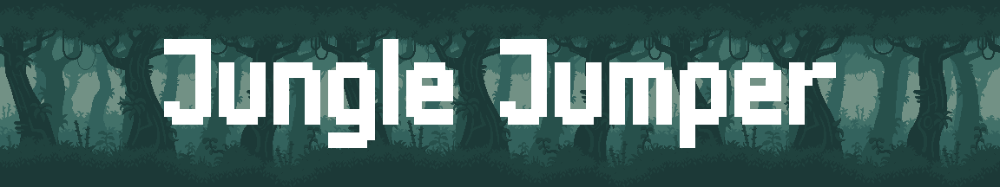

[](https://emilsadek.itch.io/jungle-jumper)
[](LICENSE)

Jungle Jumper is a one-button, side-scrolling, endless runner game developed with Lua. Run and jump through the jungle while avoiding the spiked obstacles to reach a high score.

## Installation

Clone the repository and change directories:

```bash
git clone https://github.com/esadek/jungle-jumper.git
cd jungle-jumper
```

Run the game with LÖVE:

```bash
love src
```

## Credits

Jungle Jumper was build with the following components:

- Framework: [LÖVE](https://www.love2d.org/)
- Image assets: [Jungle Pack](https://jesse-m.itch.io/jungle-pack) and [Pixel Adventure](https://pixelfrog-assets.itch.io/pixel-adventure-1)
- Music: [Cozy Tunes](https://pizzadoggy.itch.io/cozy-tunes)
- Font: [m6x11](https://managore.itch.io/m6x11)

## License

The source code for Jungle Jumper is free and open-source, released under the permissive [zlib license](LICENSE).
